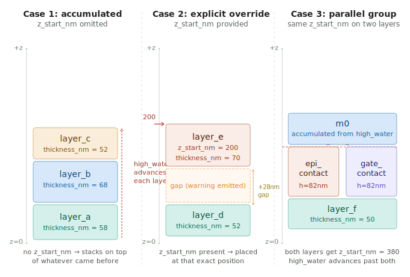
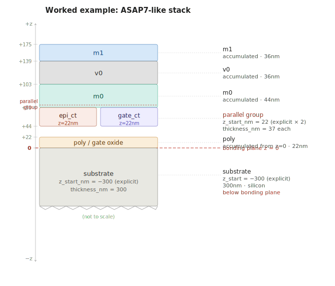
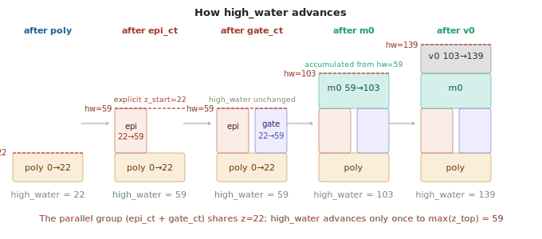

# gks TOML Z-Stack Cheat Sheet

How to define layer positions in a `genKlayoutStack` TOML file.

---

## The mental model: a stack of pancakes

Imagine laying pancakes on a plate, one at a time. Each pancake sits on top of the
previous one. You only need to know how *thick* each pancake is — the position takes
care of itself. That is the default behavior in gks.

The exception is when you need to place a pancake at a *specific* height regardless
of what came before, or when two pancakes occupy the *same* height at the same time
(parallel layers). Those cases require an explicit `z_start_nm`.

---

## The three cases



### Case 1 — accumulated (the common case)

Omit `z_start_nm`. The layer stacks on top of whatever came before.

```toml
[[layer]]
name         = "m0"
layer_num    = 6
datatype     = 0
# z_start_nm NOT present → computed automatically
thickness_nm = 36.0
material     = "metal"
```

**Rule:** `z_start = high_water` at the time this layer is processed.
`high_water` then advances to `z_start + thickness_nm`.

---

### Case 2 — explicit override

Provide `z_start_nm` to place a layer at a precise position, regardless of
what came before. The tool will warn if this creates a gap or a burial
relative to the current high_water.

```toml
[[layer]]
name         = "epi_contact"
layer_num    = 4
datatype     = 0
z_start_nm   = 105.0    # explicit: placed here regardless of high_water
thickness_nm = 45.0
material     = "tungsten"
```

**Rule:** `z_start = z_start_nm` (literal). `high_water` advances to
`max(high_water, z_start + thickness_nm)`.

**Gap warning:** if `z_start_nm > high_water`, gks warns that there is
unaccounted space between the previous layer top and this one.

**Burial warning:** if `z_start_nm < high_water`, gks warns that this layer
starts below the top of a previous layer.

---

### Case 3 — parallel group

Two or more layers that physically co-exist at the same z range (e.g. epi
contact and gate contact formed in the same deposition step). Both get the
same explicit `z_start_nm`. `high_water` advances only once, to
`max(all z_top values in the group)`.

```toml
[[layer]]
name         = "epi_contact"
layer_num    = 4
datatype     = 0
z_start_nm   = 105.0    # explicit: parallel group start
thickness_nm = 45.0
material     = "tungsten"

[[layer]]
name         = "gate_contact"
layer_num    = 5
datatype     = 0
z_start_nm   = 105.0    # explicit: same z → parallel group
thickness_nm = 45.0
material     = "tungsten"
```

**Rule:** Both entries have `physical.z_start_nm = 105.0` in the IR.
`high_water = max(high_water, 105.0 + 45.0) = 150.0`. The next accumulated
layer starts at 150.0.

---

## The placeholder pattern (fix this before editing)

Claude Code inserts these commented-out stubs as reminders. The `0.0` values
are intentionally unparseable (`???`) so you cannot accidentally leave them
in place:

```toml
# z_start_nm   = ???    # optional: explicit z start (nm, signed); omit to accumulate
# thickness_nm = ???    # required for 3D output
# material     = ???    # required for 3D output
```

For a typical sequential layer you only need to fill in two fields:

```toml
thickness_nm = 36.0
material     = "metal"
```

For a parallel group member you need all three:

```toml
z_start_nm   = 105.0
thickness_nm = 45.0
material     = "tungsten"
```

---

## The coordinate system

`z = 0` is the **bonding plane**. Negative z is below (substrate, backside
metal, TSVs). Positive z is above (FEOL, BEOL metals).

```
        +z  ↑
             │   m1, v0, m0, contacts, poly
─────────────┼─────────────  z = 0  (bonding plane)
             │   substrate, backside metal, TSVs
        −z  ↓
```

Layers below the bonding plane use a negative `z_start_nm`:

```toml
[[layer]]
name         = "substrate"
layer_num    = 0
datatype     = 0
z_start_nm   = -300.0     # 300nm below bonding plane
thickness_nm = 300.0
material     = "silicon"
```

---

## Document-level defaults

Rather than repeating the same `thickness_nm` or `material` on every layer,
set a default in `[stack.defaults]`. Per-layer values override it.

```toml
[stack.defaults]
thickness_nm = 36.0       # used for any layer that omits thickness_nm
material     = "metal"    # used for any layer that omits material
```

A layer that only differs from the default in color then needs no physical
fields at all:

```toml
[[layer]]
name        = "m2"
layer_num   = 8
datatype    = 0
fill_color  = "#0044CC"
frame_color = "#0022AA"
# thickness_nm and material inherited from [stack.defaults]
```

---

## Worked example: ASAP7-like stack



The following TOML produces the stack shown above. The first `[[layer]]` is the
**top** of the physical stack; the tool reverses document order and accumulates
z from bottom to top.

```toml
[stack]
tech_name = "ASAP7-example"
version   = "1.0.0"

[stack.defaults]
thickness_nm = 36.0

# ── Above bonding plane (top of stack — listed first) ────────────────────────

[[layer]]
name         = "m1"
layer_num    = 8
datatype     = 0
fill_color   = "#0055FF"
frame_color  = "#0033CC"
# z_start_nm omitted → accumulated from high_water = 139.0
# thickness_nm omitted → inherited from [stack.defaults] = 36.0
material     = "metal"
# high_water now = 175.0

[[layer]]
name         = "v0"
layer_num    = 7
datatype     = 0
fill_color   = "#888888"
frame_color  = "#555555"
# z_start_nm omitted → accumulated from high_water = 103.0
# thickness_nm omitted → inherited from [stack.defaults] = 36.0
material     = "tungsten"
# high_water now = 139.0

[[layer]]
name         = "m0"
layer_num    = 6
datatype     = 0
fill_color   = "#006600"
frame_color  = "#004400"
# z_start_nm omitted → accumulated from high_water = 59.0
thickness_nm = 44.0
material     = "metal"
# high_water now = 103.0

[[layer]]
name         = "gate_contact"
layer_num    = 5
datatype     = 0
fill_color   = "#8800FF"
frame_color  = "#6600CC"
z_start_nm   = 22.0       # explicit: same z → parallel group
thickness_nm = 37.0
material     = "tungsten"
# high_water stays 59.0 (max doesn't change)

[[layer]]
name         = "epi_contact"
layer_num    = 4
datatype     = 0
fill_color   = "#FF8800"
frame_color  = "#CC6600"
z_start_nm   = 22.0       # explicit: start of parallel group
thickness_nm = 37.0
material     = "tungsten"
# high_water now = max(22.0, 22+37) = 59.0

[[layer]]
name         = "poly"
layer_num    = 3
datatype     = 0
fill_color   = "#FFAA00"
frame_color  = "#CC8800"
# z_start_nm omitted → accumulated from high_water = 0.0
thickness_nm = 22.0
material     = "poly"
# high_water now = 22.0

# ── Below bonding plane (bottom of stack — listed last) ───────────────────────
# high_water starts at 0.0; substrate top = bonding plane

[[layer]]
name         = "substrate"
layer_num    = 0
datatype     = 0
purpose      = "drawing"
fill_color   = "#888888"
frame_color  = "#555555"
z_start_nm   = -300.0     # explicit: anchors the stack below z=0
thickness_nm = 300.0
material     = "silicon"
```

### How high_water advances through this stack



---

## Order sensitivity

**The order of `[[layer]]` stanzas matters** for accumulated layers.

A layer without `z_start_nm` stacks on top of whatever follows it in the
file (since document order is top-to-bottom but accumulation runs bottom-to-top).
Moving it changes its z position. Layers with explicit `z_start_nm`
are unaffected by reordering.

```
Safe to reorder:   any layer with explicit z_start_nm
Order-sensitive:   any layer without z_start_nm
```

A TOML file generated by `gks generate` (or `gks import`) always emits
explicit `z_start_nm` for every layer, so generated files are safe to
reorder freely. Only hand-authored sparse TOMLs are order-sensitive.

---

## Validation modes

Run `gks validate` before generating output to catch problems early.

```bash
# Check display properties only (no physical data required)
gks validate stack.toml --for lyp

# Check 3D physical data (thickness, z, material required for all layers)
gks validate stack.toml --for 3d

# Check everything
gks validate stack.toml --for full

# Include INFO-level messages (parallel groups, accumulation trace)
gks validate stack.toml --for full --verbose
```

| Severity | Meaning |
|----------|---------|
| ERROR    | Output cannot be generated; must fix |
| WARN     | Suspicious but allowed (gap, burial, overlapping z ranges) |
| INFO     | Informational (accumulation trace, parallel groups detected) |

---

## Quick reference

| Situation | What to write |
|-----------|--------------|
| Normal sequential layer | `thickness_nm` only; omit `z_start_nm` |
| First member of parallel group | `z_start_nm` + `thickness_nm` |
| Second+ member of parallel group | same `z_start_nm` as first member |
| Layer below bonding plane | negative `z_start_nm` (e.g. `-300.0`) |
| Same thickness as default | omit `thickness_nm` entirely |
| Display-only layer (no 3D) | omit all three physical fields |
